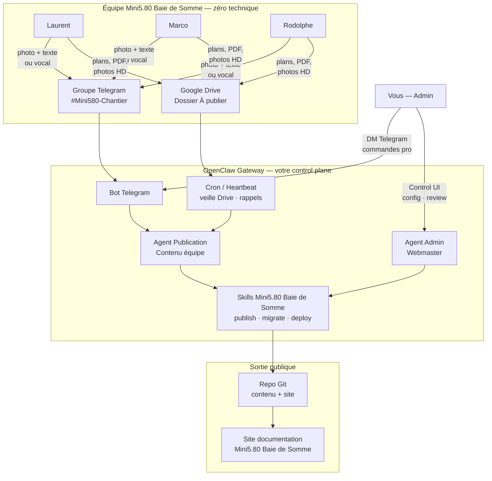
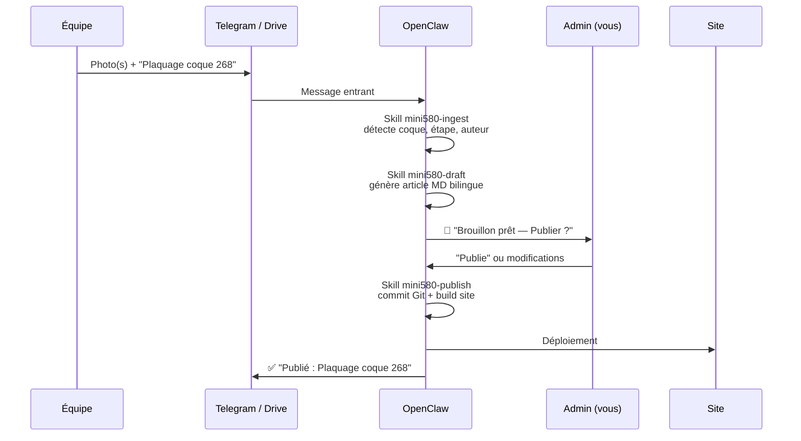

# Architecture — Plateforme OpenClaw + canaux équipe

> Vision validée — juillet 2026

## Principe directeur

**Deux mondes, une seule plateforme :**

| Rôle | Qui | Interface | Compétences requises |
|------|-----|-----------|---------------------|
| **Admin / Webmaster** | Votre compte | OpenClaw + Telegram (DM) + Control UI | Pro (vous pilotez tout) |
| **Équipe chantier** | Laurent, Marco, Rodolphe | Telegram (groupe) + Google Drive (dépôt) | Aucune — usage naturel du quotidien |

L'équipe publie comme elle communique déjà entre amis. Vous, en admin, orchestrez la plateforme, le site et la qualité via OpenClaw.

---

## Schéma global



---

## Couche 1 — Admin (vous)

### Outils

- **OpenClaw Gateway** — processus central auto-hébergé (Mac, serveur, VPS)
- **Telegram DM** — pilotage rapide depuis le téléphone
- **Control UI** — dashboard web (`openclaw dashboard`) pour config, sessions, review
- **Cursor / IDE** — développement du site et des skills (optionnel via agent OpenClaw)

### Ce que vous pouvez faire

| Action | Exemple Telegram |
|--------|------------------|
| Valider une publication équipe | *"Publie le post de Marco sur la coque 269"* |
| Créer / modifier une page | *"Ajoute une page Fournisseurs avec le contenu du Drive"* |
| Déployer le site | *"Déploie la dernière version"* |
| Modérer les commentaires | *"Réponds à la question sur l'époxy Sicomin"* |
| Configurer la plateforme | Control UI → tokens, allowlists, skills |
| Migrer le blog Blogger | *"Migre les 3 articles du blog existant"* |

### Configuration OpenClaw recommandée

```json5
// ~/.openclaw/openclaw.json (extrait conceptuel)
{
  channels: {
    telegram: {
      enabled: true,
      dmPolicy: "allowlist",           // Seul vous en DM admin
      allowFrom: ["<VOTRE_TELEGRAM_ID>"],
      groups: {
        "<Mini5.80 Baie de Somme_GROUP_ID>": {
          requireMention: false,         // L'équipe n'a pas à @mentionner
          groupPolicy: "allowlist",
          groupAllowFrom: [
            "<LAURENT_ID>",
            "<MARCO_ID>",
            "<RODOLPHE_ID>"
          ]
        }
      }
    }
  },
  agents: {
    routes: [
      { match: { channel: "telegram", peer: "dm" }, agent: "mini580-admin" },
      { match: { channel: "telegram", peer: "group:mini580" }, agent: "mini580-publisher" }
    ]
  }
}
```

---

## Couche 2 — Équipe (Laurent, Marco, Rodolphe)

### Canal principal : Groupe Telegram `#Mini580-Chantier`

Interface familière, déjà sur leur téléphone. **Aucune formation technique.**

#### Ce qu'ils font naturellement

| Gesture | Résultat côté plateforme |
|---------|--------------------------|
| Envoyer 1–10 photos + légende | Brouillon d'article créé automatiquement |
| Envoyer un message vocal | Transcription → texte d'article |
| Écrire *"Aujourd'hui pose des couples #268"* | Article tagué coque + étape chantier |
| Répondre à un fil de discussion | Commentaire ajouté à l'article |
| Poser une question | Sauvegardée → vous ou l'agent répond sur le site |

#### Règles simples pour l'équipe (1 message à leur envoyer)

> 📸 **Pour publier** : envoyez vos photos dans ce groupe avec une petite description.
> 🏷️ **Précisez si possible** : le numéro de coque (268, 269 ou 270) et l'étape (couples, plaquage, fournisseurs…).
> C'est tout. On s'occupe du reste.

### Canal secondaire : Google Drive `Mini5.80 Baie de Somme / À publier`

Pour les fichiers lourds ou structurés que Telegram compresse mal.

```
Google Drive/
└── Mini5.80 Baie de Somme/
    ├── À publier/          ← l'équipe dépose ici
    │   ├── 268-couples/
    │   ├── 269-sourcing/
    │   └── plans-cnc/
    ├── Publié/             ← archivé automatiquement après traitement
    └── Archives/
```

| Type de fichier | Exemple |
|-----------------|---------|
| Plans PDF / DXF | Découpe CNC Rodolphe |
| Photos RAW / HD | Reportage chantier |
| Tableurs | Liste fournisseurs, coûts |
| Exports 3D | Captures Onshape Laurent |

OpenClaw surveille le dossier (cron ou webhook Drive) et notifie l'admin : *"3 nouveaux fichiers dans À publier — brouillon prêt pour review"*.

---

## Pipeline de publication



### Modes de publication

| Mode | Quand | Qui valide |
|------|-------|------------|
| **Review** (défaut) | Articles importants, premiers posts | Admin approuve via Telegram |
| **Auto** | Photos chantier routinières, l'équipe est rodée | Publication directe + notification admin |
| **Brouillon** | Contenu incomplet | Reste en `draft/` jusqu'à validation |

---

## Site de documentation (sortie publique)

### Stack recommandée

| Composant | Choix | Raison |
|-----------|-------|--------|
| Générateur site | **Astro** ou **Next.js** (statique) | Rapide, SEO, bilingue FR/EN |
| Contenu | **Markdown + YAML** dans ce repo | OpenClaw écrit directement dans Git |
| Images | `public/images/{coque}/{date}/` | Organisation par chantier |
| Hébergement | Vercel / Netlify / GitHub Pages | Déploiement auto depuis Git |
| Domaine | À définir (mini580-somme.fr, mini580-somme.fr…) | |

### Structure de contenu cible

```
content/
├── articles/
│   ├── 2026-03-presentation-equipe.md
│   ├── 2026-05-choix-fournisseurs.md
│   └── ...
├── chantier/
│   ├── 268-laurent/
│   ├── 269-marco/
│   └── 270-rodolphe/
├── etapes-classe/          # Checklist obligatoire Class Globe 5.80
│   ├── couples.md
│   ├── plaquage.md
│   └── ...
├── fournisseurs/
└── faq/
```

---

## Skills OpenClaw à développer

Skills personnalisés dans `.openclaw/skills/` ou `skills/` du workspace :

| Skill | Rôle |
|-------|------|
| `mini580-ingest` | Reçoit message Telegram / fichier Drive, extrait métadonnées (coque, auteur, étape) |
| `mini580-draft` | Génère article Markdown bilingue FR/EN à partir du contenu brut |
| `mini580-publish` | Commit Git, optimise images, déclenche build + deploy |
| `mini580-migrate` | Importe les articles Blogger existants |
| `mini580-class-checklist` | Vérifie quelles étapes obligatoires classe sont documentées |
| `mini580-reply` | Gère questions/commentaires visiteurs → notification équipe |

---

## Sécurité & accès

| Zone | Accès |
|------|-------|
| OpenClaw Gateway | Vous seul (machine / VPS privé) |
| Telegram DM bot | Allowlist : votre ID uniquement |
| Groupe Mini5.80 Baie de Somme | Laurent, Marco, Rodolphe + vous |
| Google Drive | Dossier partagé équipe, pas de droits admin site |
| Repo Git | Admin : push direct ; équipe : aucun accès Git requis |
| Site public | Lecture seule pour visiteurs ; commentaires modérés |

---

## Plan de mise en œuvre

### Phase 1 — Fondations (semaine 1–2)
- [ ] Installer OpenClaw + configurer bot Telegram
- [ ] Créer groupe `#Mini580-Chantier` + Google Drive partagé
- [ ] Squelette site Astro/Next.js dans ce repo
- [ ] Migrer les 3 articles Blogger existants

### Phase 2 — Pipeline publication (semaine 3–4)
- [ ] Skill `mini580-ingest` + `mini580-draft`
- [ ] Workflow review admin via Telegram
- [ ] Premier post chantier publié par l'équipe via Telegram seul

### Phase 3 — Enrichissement (mois 2)
- [ ] Intégration Google Drive
- [ ] Checklist étapes classe Globe 5.80
- [ ] Pages fournisseurs, FAQ, galerie par coque
- [ ] Mode auto-publication pour photos routinières

### Phase 4 — Communication (mois 3+)
- [ ] Commentaires / questions visiteurs
- [ ] Newsletter
- [ ] Lien avec communauté Class Globe 5.80 officielle

---

## Ce que l'équipe n'a JAMAIS à faire

- Ouvrir un CMS ou un éditeur web
- Écrire du Markdown ou du HTML
- Gérer Git, déploiement, DNS
- Redimensionner des images
- Traduire en anglais (automatisé)
- Se connecter à un back-office

**Ils envoient. La plateforme transforme. Vous validez (ou pas). Le site se met à jour.**
