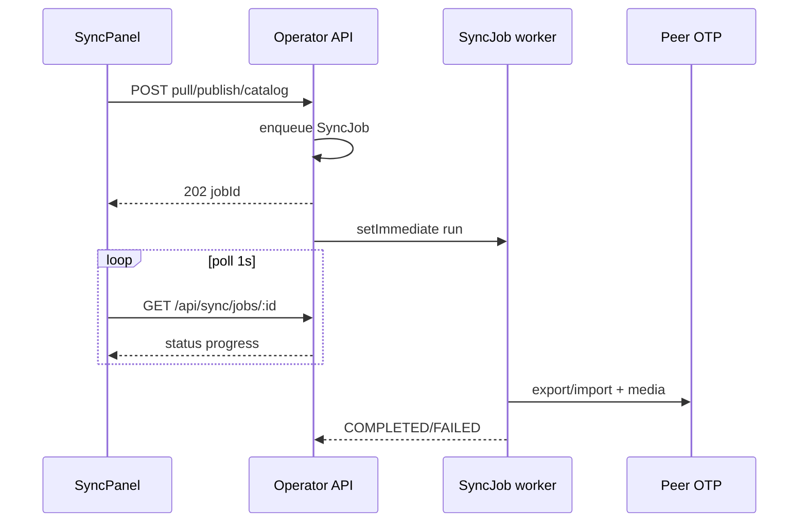

# Sync TEST ↔ PROD

> Jobs async · verrou global · OTP Ed25519 · médias multipart + checksum SHA-256

## Principes

| Action | Comportement |
|--------|----------------|
| **Tirer depuis PROD** (sur TEST) | Job async : catalogue + articles + **binaires médias**. Upsert par même `id`. Posts TEST-only conservés. |
| **Publier sur PROD** (depuis TEST) | Job async : push médias puis import article (même id). |
| **Catalogue** | Tags / Thèmes / Jalons — pull ou push (async). |
| **Verrou** | Un seul job `PENDING`/`RUNNING` à la fois → HTTP **409** si une sync est déjà en cours. |

## Flux async

## Médias

| Direction | Mécanisme |
|-----------|-----------|
| Pull PROD→TEST | `GET /api/sync/peer/media?key=` (OTP `media_export`) → headers `Content-Type` + `X-Content-Sha256` → vérif → `putObject` local |
| Push TEST→PROD | `POST /api/sync/peer/media` multipart : `file` + `key` + `contentType` + `checksum` (SHA-256 hex), OTP `media_import` |

Les clés objet restent les mêmes (`/media/{yyyy}/{mm}/{uuid}/…`) sur les deux hôtes.

## API

| Route | Auth | Rôle |
|-------|------|------|
| `POST /api/sync/pull-from-prod` | Session (TEST) | Enqueue pull + médias → **202** |
| `POST /api/sync/publish-to-prod` | Session (TEST) | Enqueue publish post + médias → **202** |
| `POST /api/sync/publish-milestone-to-prod` | Session (TEST) | Enqueue jalon → **202** |
| `POST /api/sync/catalog` `{ direction }` | Session | Enqueue pull/push catalogue → **202** |
| `GET /api/sync/jobs/:id` | Session | Poll job |
| `GET /api/sync/status` | Session | Diff + `activeJob` |
| `GET/POST /api/sync/peer/media` | OTP peer | Export / import binaire |

## UI

`/editeur/sync` — boutons désactivés tant qu’un job tourne ; progression affichée (étape médias `current/total`).
