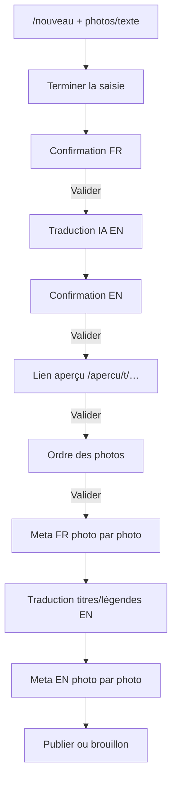

# Publication Telegram assistée par IA

> Phase 2 — flux admin / comptes autorisés (liste d'IDs Telegram)

## Objectif

Publier un article bilingue (FR → EN) depuis Telegram, avec validation pas à pas :
contenu, traduction, aperçu, ordre des photos, métadonnées et transforms par photo.

## Agent intelligent (tools plateforme)

Par défaut, Telegram parle à un **agent Cursor** qui appelle les endpoints via `AI_TOOLS` (`Bearer INGEST_API_KEY` + header `X-Telegram-User-Id`) :

- lire / rechercher posts, galerie multi-médias, tags, thèmes, jalons
- CRUD articles + publish/archive — **auteur = utilisateur Telegram mappé** (pas toujours le compte service)
- médiathèque indépendante `Media` (IMAGE|DOCUMENT|VIDEO) : `media.*` tools — create/update/delete/attach/detach/reorder/set_cover
- tools `photos.*` conservés en compat (même modèle sous-jacent)
- liens d’aperçu `preview.create` → `/apercu/t/{token}`
- traduction FR→EN (`translate`)

Parcours guidé conservé : `/nouveau`.

Fichiers clés : `web/src/lib/telegram/agent.ts`, `telegram-auth.ts`, `ai-tools.ts`, `ai-tools-runtime.ts`, `media-library.ts`.

## Auteur Telegram → User backoffice

Chaque post créé via Telegram (parcours `/nouveau` ou agent) reçoit `authorId` du **compte plateforme** correspondant à l’utilisateur Telegram, pas systématiquement `TELEGRAM_SERVICE_USER_EMAIL`.

Résolution (uniquement si l’ID Telegram est dans `TELEGRAM_ALLOWED_USER_IDS`) :

1. **`User.telegramUserId`** en base (recommandé — persistant, unique)
2. **`TELEGRAM_USER_MAP`** — ex. `8137936505:lpatrouix@gmail.com,7257839706:admin@classmini580.blog`
3. **Fallback** — `TELEGRAM_SERVICE_USER_EMAIL` (ou `SEED_ADMIN_EMAIL`)

Le header `X-Telegram-User-Id` n’est pris en compte qu’avec un `Authorization: Bearer` valide (`INGEST_API_KEY`). Sans header, le compte service est utilisé (comportement machine-to-machine classique).

Configurer en DB (ex. Laurent) :

```sql
UPDATE "User" SET "telegramUserId" = '8137936505' WHERE email = 'lpatrouix@gmail.com';
```

## Prérequis

| Variable | Rôle |
|----------|------|
| `TELEGRAM_BOT_TOKEN` | Bot Telegram |
| `TELEGRAM_WEBHOOK_SECRET` | Secret header webhook |
| `TELEGRAM_ALLOWED_USER_IDS` | IDs numériques autorisés |
| `TELEGRAM_SERVICE_USER_EMAIL` | Auteur par défaut (fallback si pas de mapping) |
| `TELEGRAM_USER_MAP` | Mapping optionnel `telegramId:email,...` (si `User.telegramUserId` absent en DB) |
| `INGEST_API_KEY` | Bearer pour appels machine (OpenClaw) |
| `CURSOR_API_KEY` | Accès modèle IA via `@cursor/sdk` (traduction / parsing) |
| `CURSOR_MODEL` | Modèle Cursor (défaut `composer-2.5`) |
| `SITE_URL` | Liens d'aperçu absolus |

Migration : `media_library` (`Media` + `PostMedia` depuis `PostImage`) · `telegram_publish_flow` · `PreviewToken`.

## Brancher le webhook

```bash
curl "https://api.telegram.org/bot$TELEGRAM_BOT_TOKEN/setWebhook" \
  -d "url=https://test.classmini580.blog/api/telegram/webhook" \
  -d "secret_token=$TELEGRAM_WEBHOOK_SECRET"
```

## Commandes bot

| Commande | Effet |
|----------|-------|
| `/nouveau` | Démarre une session de publication |
| `/statut` | Affiche l'étape courante |
| `/annuler` | Annule la session |
| `/traduire` | Relance la traduction EN |

## Parcours



## Modèle photo

Chaque `Media` stocke :

- `kind` : IMAGE | DOCUMENT | VIDEO
- `urlOrigin` + (IMAGE) formats dérivés `urlPicto` / `urlPetite` / `urlMoyenne` / `urlGrande` — **tous en `/media/...` local**
- `titleFr/En`, `descriptionFr/En`, `takenAt`
- Layout IMAGE (`ImageLayoutParams`) : `offsetX/Y`, `scaleX/Y`, `rotation`, `cropShape`, `cropInset`, `backgroundColor` + champs legacy sync (`focusX/Y`, `zoom`, …)
- liaison articles via `PostMedia` (`sortOrder`, `isCover`) — 0 à N posts

**Intégrité** : édition layout / rebake refusés si origin absente ou URL externe (422). Upload Telegram → bucket local direct. Médias Blogger historiques : re-upload originale requise — voir `docs/12-photo-editor-medias.md`.

Les variants IMAGE sont régénérés au save layout (sharp, origin locale). Affichage public : variants rebakés (WYSIWYG avec l’éditeur).

## API tools médias (éditeur + assistant IA)

Auth : cookie session **ou** `Authorization: Bearer <INGEST_API_KEY>` (optionnel : `X-Telegram-User-Id` pour auteur mappé).

| Tool | Méthode |
|------|---------|
| Galerie publique | `GET /api/gallery?kind=&hull=&theme=&tag=&milestone=&search=&sort=` |
| Médiathèque liste | `GET /api/media-library?q=&kind=&limit=&offset=` |
| Médiathèque CRUD | `POST/PATCH/DELETE /api/media-library` · `…/:id` · `…/:id/replace` |
| Médias d’un post | `GET/POST /api/posts/:id/media` |
| Détacher | `DELETE /api/posts/:id/media/:mediaId` |
| Réordonner | `PUT /api/posts/:id/media/reorder` `{ mediaIds }` |
| Couverture | `POST /api/posts/:id/media/:mediaId/cover` |
| Compat photos | `…/posts/:id/images*` (mêmes données sous-jacentes) |
| Bucket brut | `POST /api/media` |

## Secrets CI/CD (IA + Telegram)

Injectés à chaque deploy depuis GitHub → `/opt/mini580/{test,prod}/.env` (voir `docs/07-deploy-cicd.md`).

| Variable | Portée GitHub | Rôle |
|----------|---------------|------|
| `CURSOR_API_KEY` / `CURSOR_MODEL` | Repo | Modèle IA |
| `TELEGRAM_*` | Environment `test` / `prod` | Bot + webhook + allowlist |
| `INGEST_API_KEY` | Environment | Bearer tools HTTP |

```bash
# Repo
gh secret set CURSOR_API_KEY --repo mini580-baie-de-somme/mini-580
# Environment (bots distincts TEST/PROD)
gh secret set TELEGRAM_BOT_TOKEN --env prod --repo mini580-baie-de-somme/mini-580
gh secret set TELEGRAM_WEBHOOK_SECRET --env prod --repo mini580-baie-de-somme/mini-580
# puis Deploy TEST / Deploy PROD
```

## Sécurité

- Allowlist stricte d'IDs Telegram
- Secret webhook Telegram
- Aperçu partagé à token opaque, expiration 72 h, `robots: noindex`
- Mutations API : cookie session **ou** Bearer `INGEST_API_KEY`
