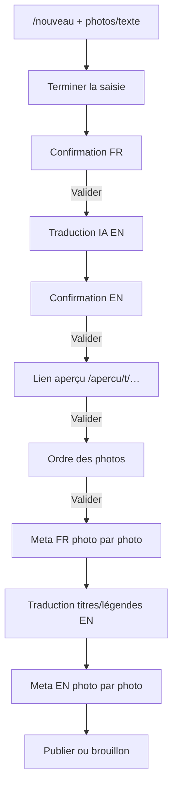

# Publication Telegram assistée par IA

> Phase 2 — flux admin / comptes autorisés (liste d'IDs Telegram)

## Objectif

Publier un article bilingue (FR → EN) depuis Telegram, avec validation pas à pas :
contenu, traduction, aperçu, ordre des photos, métadonnées et transforms par photo.

## Prérequis

| Variable | Rôle |
|----------|------|
| `TELEGRAM_BOT_TOKEN` | Bot Telegram |
| `TELEGRAM_WEBHOOK_SECRET` | Secret header webhook |
| `TELEGRAM_ALLOWED_USER_IDS` | IDs numériques autorisés |
| `TELEGRAM_SERVICE_USER_EMAIL` | Auteur DB des posts bot |
| `INGEST_API_KEY` | Bearer pour appels machine (OpenClaw) |
| `OPENAI_API_KEY` | Traduction / parsing IA |
| `SITE_URL` | Liens d'aperçu absolus |

Migration : `telegram_publish_flow` (PostImage enrichi + `TelegramPublishSession` + `PreviewToken`).

## Brancher le webhook

```bash
curl "https://api.telegram.org/bot$TELEGRAM_BOT_TOKEN/setWebhook" \
  -d "url=https://test.classmini580.blog/api/telegram/webhook" \
  -d "secret_token=$TELEGRAM_WEBHOOK_SECRET"
```

## Commandes bot

| Commande | Effet |
|----------|-------|
| `/nouveau` | Démarre une session de publication |
| `/statut` | Affiche l'étape courante |
| `/annuler` | Annule la session |
| `/traduire` | Relance la traduction EN |

## Parcours



## Modèle photo

Chaque `PostImage` stocke :

- `titleFr/En`, `captionFr/En`, `takenAt`, `sortOrder`
- transforms CSS : `focusX/Y`, `zoom`, `rotation`, `cropX/Y/W/H`

Le fichier source n'est pas réencodé ; l'affichage applique le transform (`GalleryImage`).

## Sécurité

- Allowlist stricte d'IDs Telegram
- Secret webhook Telegram
- Aperçu partagé à token opaque, expiration 72 h, `robots: noindex`
- Mutations API : cookie session **ou** Bearer `INGEST_API_KEY`
