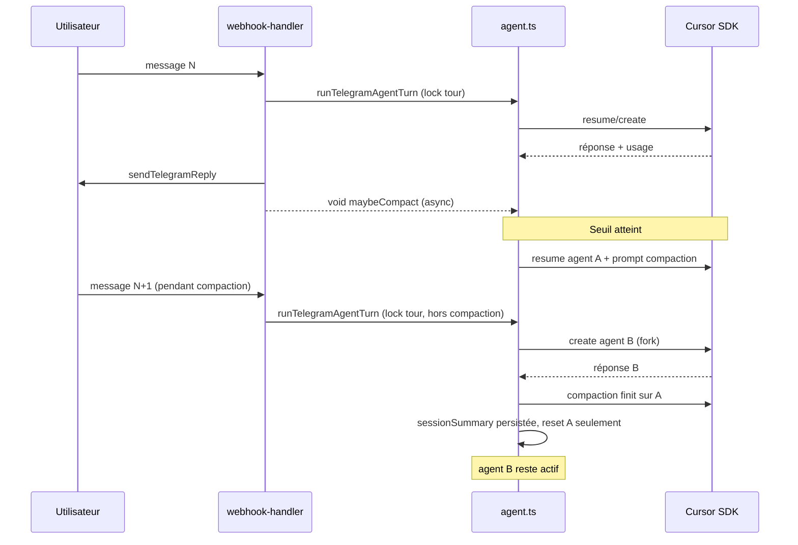

# Compaction agent Telegram — invariants & non-régression

> Complète `docs/09-telegram-publish.md` · implémentation `web/src/lib/telegram/agent.ts`

## Invariants produit (ne jamais casser)

1. **Déclenchement post-réponse** — la compaction ne démarre qu'**après** `sendTelegramReply`, jamais au début du tour suivant.
2. **Seuil sur le tour terminé** — `lastTurnInputTokens` du run qui vient de finir ≥ 70 % de `TELEGRAM_AGENT_CONTEXT_MAX_TOKENS` (défaut 128k).
3. **Non bloquante** — `maybeCompactTelegramSessionAfterTurn` est fire-and-forget ; le tour utilisateur N+1 ne doit **pas** attendre la fin du compactage.
4. **Fork pendant compaction** — si un message arrive pendant compaction : **pas** de `Agent.resume` sur l'agent en cours de compactage → bootstrap sur un **nouvel** agent Cursor.
5. **Reset conditionnel** — `cursorAgentId` remis à `null` seulement si toujours l'agent snapshot compacté (`updateMany` optimiste). Un fil forké pendant compaction est **préservé**.
6. **Échec compaction** — synthèse vide ou erreur → **ne pas** effacer `cursorAgentId` ni remplacer `sessionSummary`.
7. **Continuité post-compaction** — `sessionSummary` injecté au prochain bootstrap ; les paires Q/R post-fork restent sur le fil actif.
8. **Timeout run** — `run.wait()` plafonné (`TELEGRAM_AGENT_RUN_TIMEOUT_MS`, défaut 120s) → message d'erreur + suggestion `/reset`, jamais silence infini (⏳).
9. **Verrou tours utilisateur** — `withThreadTurnLock` sérialise les tours sur un fil Telegram ; la compaction reste **hors** ce lock.
10. **Webhook** — ack HTTP immédiat ; traitement agent via `after()` (Next.js) ou équivalent.

## Flow cible

## Checklist avant merge / deploy PROD

- [ ] `npm run test:local` — inclut `telegram-agent-compaction.test.ts`
- [ ] `npm run test:telegram` — inclut `compaction-regression.test.ts` + scénarios FSM existants
- [ ] Pas de `withThreadTurnLock` autour de `maybeCompactTelegramSessionAfterTurn`
- [ ] `compactingAgentIds` + fork bootstrap testés
- [ ] Timeout 120s (ou env) sur tous les `run.wait()`
- [ ] Webhook : compaction **après** reply, pas dans le `catch` du tour
- [ ] Clone **simohra.fr** aligné (même invariants, branding Simohra conservé)

## Tests automatisés

| Fichier | Couverture |
|---------|------------|
| `session-context.test.ts` | Seuil 70 %, messages bootstrap/tour |
| `telegram-agent-compaction.test.ts` | Non-blocage, fork, reset conditionnel, échec, timeout, lock tours, bootstrap summary |
| `compaction-regression.test.ts` | Ordre reply → compaction, pas de compaction si tour KO, webhook ack |

## Variables d'environnement

| Variable | Défaut | Rôle |
|----------|--------|------|
| `TELEGRAM_AGENT_CONTEXT_MAX_TOKENS` | `128000` | Fenêtre pour seuil compaction |
| `TELEGRAM_AGENT_COMPACT_HIGH_RATIO` | `0.7` | Seuil déclenchement |
| `TELEGRAM_AGENT_COMPACT_TARGET_RATIO` | `0.2` | Cible doc (prompt interne) |
| `TELEGRAM_AGENT_RUN_TIMEOUT_MS` | `120000` | Timeout `run.wait()` |

## Historique incidents

| Version | Problème | Fix |
|---------|----------|-----|
| v1.2.89 | Hang infini ⏳ — race compaction + pas de timeout | Lock tours, timeout 120s, `after()` webhook |
| v1.2.90 | Tour N+1 bloqué pendant compaction (~30–60s) | Compaction hors lock, fork agent, reset optimiste |

## Clones (simohra.fr)

Le même module `web/src/lib/telegram/agent.ts` doit rester aligné sur ces invariants. Différences autorisées : `SYSTEM_BRIEF`, `getCursorCwd()`, texte `SESSION_COMPACT_USER_PROMPT` (nom du site).
